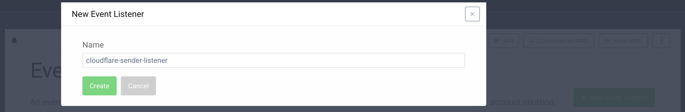
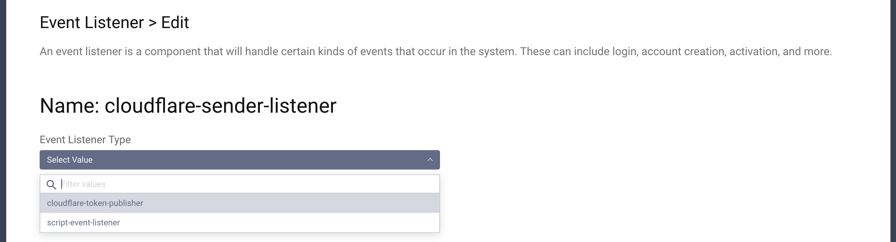
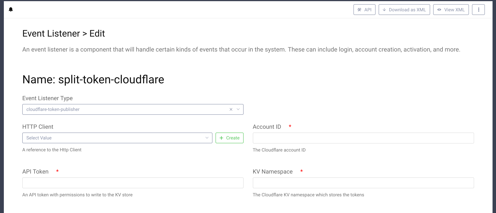

# Cloudflare Token Publisher Demo Plugin

This is an example event listener SDK Plugin for the Curity Identity Server. The plugin registers an event listener 
listening for issued access token events, and forwards them to Cloudflare KV store.

## Building, installation and configuration

To build the plugin, simply download it and run `mvn package`. This creates `target/identityserver.plugins.events.listeners.cloudflare-token-publisher-0.1.0.jar`.
Create a new folder `cloudflare_token_publisher` in `<idsvr_home>/usr/share/plugins/` then copy the jar to that folder
and (re)start the Curity Identity Server. Configure a new event listener (shown here using the Admin UI, but might just
as well be configured through the CLI, REST or XML):

Pick a suitable name and then select the "cloudflare-token-publisher" type:

Configure your listener by adding:

- your Cloudflare account ID
- a Cloudflare API token which has permissions to write to the workers KV store
- the ID of the KV namespace which should be used to store the tokens

Please visit [curity.io](https://curity.io/) for more information about the Curity Identity Server.
